# Linux

> 慢慢来比较快
>
> 兴趣是最好的老师


==Linux一切皆文件：文件（读写执行rwx）、权限（用户、用户组）、系统（磁盘、进程）==

上面就是主要的Linux学习脉络，平时用到的命令通过 man -h 来查看即可n


## 安装

### Windows Linux 子系统

略

### 云服务器

略

### 虚拟机

模拟分布式

VMware Workstation Pro 安装 CentOS 7；学习版本为 CentOS 7，不同版本命令差别较大

下载镜像：http://mirrors.aliyun.com/centos/7/isos/x86_64/


## 基础

### Systemd

mysql**d**, firewall**d**，字母 d 是代表守护进程daemon

```bash
systemctl --version #
```


更多参考阮一峰：http://www.ruanyifeng.com/blog/2016/03/systemd-tutorial-commands.html


#### Unit

Systemd 可以管理所有系统资源。不同的资源统称为 Unit（单位）。


#### 常用命令

```bash
#设置开机自启，本质是建立启动链接
systemctl enable nginx

# 显示某个 Unit 服务是否建立了启动链接
systemctl is-enabled application.service

#重载所有修改过的配置文件
systemctl daemon-reload 
```


> 开机自启

`systemctl enable` 等同于在`/etc/systemd/system/multi-user.target.wants/clamd@scan.service`  目录下建立软连接。

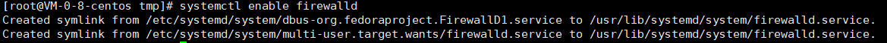

可查看所有开机启动的服务。

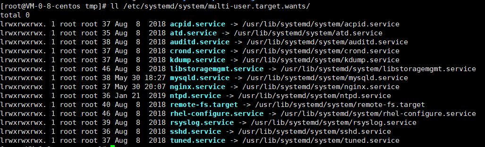


### 基础命令

> hostname

查看主机名：`hostname`

修改主机名：`hostname xinbook`  ，修改完毕重新连接服务器即可


> ll 查看目录

ll -lh  将字节转为 M


> 解压

```shell
tar -zvxf redis-6.2.3.tar.gz
```

-C 指定目录

> CURL 访问

curl www.baidu.com　　访问一个网页

curl -i www.baidu.com　　显示响应的头信息

curl -v www.baidu.com　　显示一次http请求的通信过程

curl -X GET/PUT/POST/DELETE url　　执行GET/PUT/POST/DELETE操作（必须用大写）

> wget 下载

```bash
wget https://dev.mysql.com/get/mysql57-community-release-el7-11.noarch.rpm
```


> make

make 是编译（如编译 redis 源文件）：输出是类文件

make install 安装


### Vim 编辑器

> 批量替换

:%s/<source>/<target>/g

### 目录介绍

/bin bin是Binary的缩写。这个目录存放着最经常使用的命令。

/boot这里存放的是启动Linux时使用的一些核心文件，包括一些连接文件以及镜像文件。

/dev dev是Device(设备)的缩写。该目录下存放的是Linux的外部设备，在Linux中访问设备的方式和访问文件的方式是相同的。

/etc这个目录用来存放所有的系统管理所需要的配置文件和子目录（**还有环境变量**）

/home用户的主目录，在Linux中，每个用户都有一个自己的目录，一般该目录名是以用户的账号命名的。

/lib这个目录里存放着系统最基本的动态连接共享库，其作用类似于Windows里的DLL文件。几乎所有的应用程序都需要用到这些共享库。

/lost+found这个目录一般情况下是空的，当系统非法关机后，这里就存放了一些文件。

/media linux系统会自动识别一些设备，例如U盘、光驱等等，当识别后，linux会把识别的设备挂载到这个目录下。

/mnt系统提供该目录是为了让用户临时挂载别的文件系统的，我们可以将光驱挂载在/mnt/上，然后进入该目录就可以查看光驱里的内容了。

/opt 这是给主机额外安装软件所摆放的目录。比如你安装一个ORACLE数据库则就可以放到这个目录下。默认是空的。

/proc这个目录是一个虚拟的目录，它是系统内存的映射，我们可以通过直接访问这个目录来获取系统信息。这个目录的内容不在硬盘上而是在内存里，我们也可以直接修改里面的某些文件，比如可以通过下面的命令来屏蔽主机的ping命令，使别人无法ping你的机器：

echo 1 > /proc/sys/net/ipv4/icmp_echo_ignore_all。

/root该目录为系统管理员，也称作超级权限者的用户主目录。

/sbin s就是Super User的意思，这里存放的是系统管理员使用的系统管理程序。

/selinux 这个目录是Redhat/CentOS所特有的目录，Selinux是一个安全机制，类似于windows的防火墙，但是这套机制比较复杂，这个目录就是存放selinux相关的文件的。

/srv 该目录存放一些服务启动之后需要提取的数据。

/sys 这是linux2.6内核的一个很大的变化。该目录下安装了2.6内核中新出现的一个文件系统 sysfs ，sysfs文件系统集成了下面3种文件系统的信息：针对进程信息的proc文件系统、针对设备的devfs文件系统以及针对伪终端的devpts文件系统。该文件系统是内核设备树的一个直观反映。当一个内核对象被创建的时候，对应的文件和目录也在内核对象子系统种被创建。

/tmp这个目录是用来存放一些临时文件的。

/usr 这是一个非常重要的目录，用户的很多应用程序和文件都放在这个目录下，类似与windows下的program files目录。

/usr/bin：系统用户使用的应用程序。

/usr/sbin：超级用户使用的比较高级的管理程序和系统守护程序。

/usr/src：内核源代码默认的放置目录。

/var这个目录中存放着在不断扩充着的东西，我们习惯将那些经常被修改的目录放在这个目录下。包括各种日志文件。


### 账号管理

==Linux 中一切皆文件，添加用户实质也是往某一个文件中写入用户的信息==

**查看用户**

`cat /etc/password`


**添加用户**

`useradd -m xincan`

-m：自动创建这个用户的主目录 /home/xincan

**删除用户**

`userdel -r xincan`

-r 删除用户的时候将他的目录一起删除

**修改用户**

`usermod`

**切换用户**

1. 切换用户到 xincan：`su xincan`  
2. 退出当前身份 `exit`
3. 切换root快捷方式：`sudo su`

**密码管理**

超级用户

* 新建密码 `passwd xincan` ： Xc_2[o]!@#
* re passwd

普通用户

* passwd  更改密码

**锁定账号**

冻结账号，一旦冻结，该用户就登录不上系统

```bash
passwd -l xincan # 锁定之后用户不能登录
passwd -d xincan # 删除密码后用户不能登录
```

**更新用户组**

默认创建的用户，会自动创建一个同名的用户组

```bash
usermod -g <grp> <user>  #更新用户组 
groups #查看自身所在组
groups <user> #查看user所在组
```


### 磁盘管理

> `df`   列出文件系统的整体磁盘使用情况；`du` 检查磁盘空间使用量

`df -h` 按M（兆）单位查看

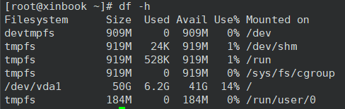	


`du -sm /*` 检查根目录下每个目录所占用的容量

> 挂载移动磁盘或者文件

挂载：mount

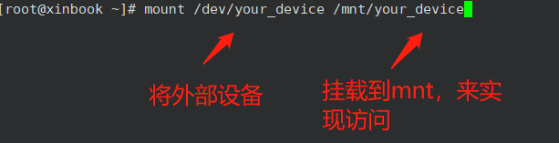	

卸载：umount -f [挂载位置]

### 进程管理

> 基本概念

1、在Linux中，每一个程序都是有自己的一个进程，每一个进程都有一个id号！
2、每一个进程呢，都会有一个父进程！
3、进程可以有两种存在方式：前台！后台运行！
4、一般的话服务都是后台运行的，基本的程序都是前台运行的！  

> 命令

**ps 查看进程**

ps 参数（参数可叠加）：

* -a 显示当前进程，仅一个
* -u 以用户的信息显示进程
* -x 显示后台运行进程的参数！  

`ps -xx|grep `   查找具体信息

`ps -ef `   显示进程的父进程信息

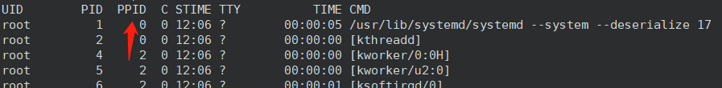

pstree 以进程树的方式查看进程关系

* -p  显示父id
* -u 显示用户组

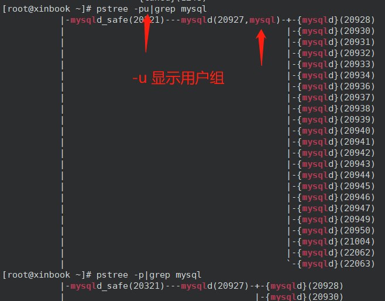

**结束进程**

`kill -9 进程的id`

一般用于结束业务的java死循环的进程


**后台运行**

`nohup`  代表后台执行


#### 部署

jar 包，如 spring-boot 直接用 java 执行

war包，需要放入 tomcat webapps 下执行

#### 端口管理（firewalld）

> 服务器防火墙端口打开，且云服务器控制台的安全组也开放，则可以远程访问！

服务器上的端口为空

	

控制台已开放一部分端口，与服务器上的端口需要同时开启

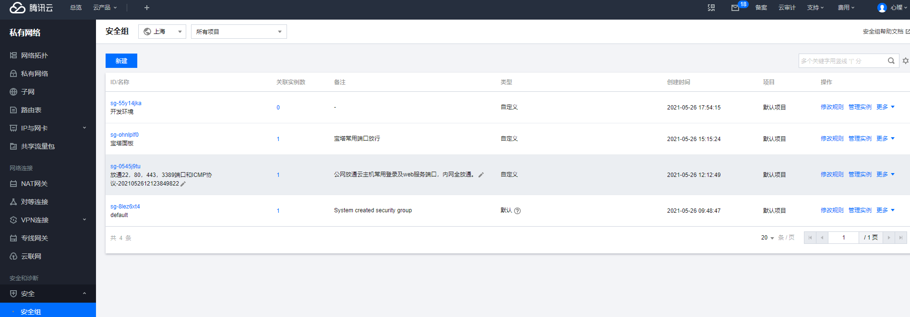


> 开启端口

```bash
#常用
firewall-cmd --zone=public --add-port=8080/tcp --permanent
firewall-cmd --zone=public --add-port=3306/tcp --permanent
firewall-cmd --zone=public --add-port=6379/tcp --permanent
firewall-cmd --zone=public --add-port=80/tcp --permanent
firewall-cmd --zone=public --add-port=443/tcp --permanent

firewall-cmd --zone=public --add-port=9001/tcp --permanent
firewall-cmd --zone=public --add-port=9/tcp --permanent

#重启
systemctl restart firewalld.service
```


```bash
# 查看firewall服务状态
systemctl status firewalld
# 开启、重启、关闭、firewalld.service服务
# 开启
service firewalld start
# 重启
service firewalld restart
# 关闭
service firewalld stop
# 查看防火墙规则
firewall-cmd --list-all # 查看全部信息
firewall-cmd --list-ports # 只看端口信息
# 开启端口
开端口命令：firewall-cmd --zone=public --add-port=8080/tcp --permanent
重启防火墙：systemctl restart firewalld.service
命令含义：
--zone #作用域
--add-port=80/tcp #添加端口，格式为：端口/通讯协议
--permanent #永久生效，没有此参数重启后失效

```

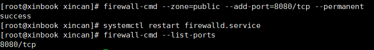

域名解析后，如果端口是80 - http 或者 443-https 可以直接访问，如果是 9000 8080，就需要通过
Apcahe或者Nginx做一下反向代理即可，配置文件即可  


## 域名

购买域名

申请备案

域名解析：配置三级域名  xx.domain.com


# CentOS 7

## 命令

### systemctl 

启停服务

* start
* stop
* status 查看状态


### yum

yum list installed

yum list erlang

yum remove erlang

yum check-update 检查可更新的软件包

yum update 升级所有软件包

yum update tomcat  升级具体软件


## 环境安装

安装软件一般有三种方式，并分别以三个例子讲解：

* rpm（Jdk：在线发布一个SringBoot项目！）
* 解压缩（tomcat，启动并通过外网访问，发布网站）
* yum在线安装（docker：直接安装运行跑起来docker就可以！）！  


### JDK安装（rpm）

**下载安装**

JDK下载 https://www.oracle.com/technetwork/java/javase/downloads/jdk8-downloads-2133151.html

选择下面版本

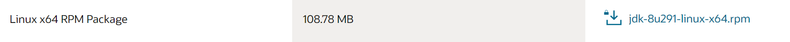

打开 xftp 将本地的 rpm 包拷贝到用户目录

**开始安装**

安装需要 root 身份

```bash
rpm -ivh jdk-8u291-linux-x64.rpm 
```

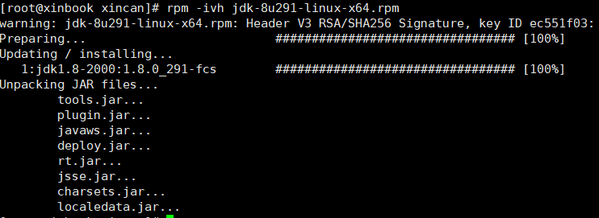

安装成功后，用 `java -version` 能检测到java环境

==安装目录在 /usr/java/jdk1.8.0_291-amd64/==

**卸载安装**

```bash
rpm -qa|grep jdk # 如得到 jdk1.8-1.8.0_291-fcs.x86_64
rpm -e --nodeps jdk1.8-1.8.0_291-fcs.x86_64  #卸载
```

```bash
# rpm 常用命令
rpm -qa|grep jdk # 检测JDK版本信息/是否已安装
rpm -e --nodeps jdk_ #卸载
```


**配置环境变量**

编辑 `/etc/profile`，在文件最后添加配置

```shell
export JAVA_HOME=/usr/java/jdk1.8.0_291-amd64 #其他软件依赖
export CLASSPATH=.:$JAVA_HOME/lib/dt.jar:$JAVA_HOME/lib/tools.jar # .为当前目录，用于JVM查找类
export PATH=$JAVA_HOME/bin:$PATH
```

让配置文件生效

`source /etc/profile`

==注意==若 /etc/profile 文件损坏，则所有命令都会失效。

补救措施：`export PATH=/usr/local/sbin:/usr/local/bin:/sbin:/bin:/usr/sbin:/usr/bin:/root/bin  `


### Tomcat 9安装（tar.gz）

1. 下载：https://tomcat.apache.org/download-90.cgi
2. 解压

```bash
 tar -zxvf apache-tomcat-9.0.46.tar.gz -C /opt #解压到 /opt 自定义程序目录
```

3. 启动

```bash
[root@VM-0-8-centos apache-tomcat-10.0.6]# ./bin/startup.sh
```

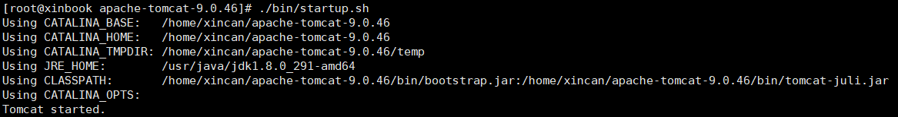

4. 测试

```bash
[root@VM-0-8-centos apache-tomcat-10.0.6]# curl -v http://127.0.0.1:8080 
```


### mysql 安装(yum)

1. 下载MySQL5.7 rpm：https://dev.mysql.com/get/mysql57-community-release-el7-11.noarch.rpm
2. 安装 mysql 源

```bash
yum localinstall mysql57-community-release-el7-11.noarch.rpm #安装源
```

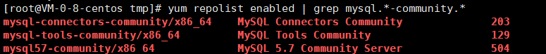

3. 安装mysql

```bash
 yum install -y mysql-community-server
```

4. 启动服务

```bash
systemctl start mysqld
```

5. 查看服务状态

```bash
 systemctl status mysqld
```

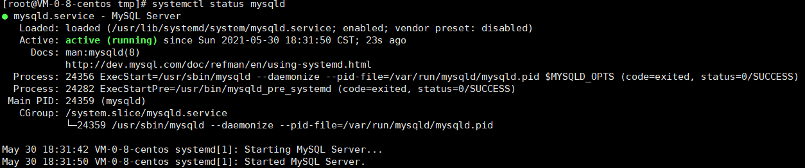

6. 开机启动

```bash
systemctl enable mysqld # 修改配置
systemctl daemon-reload # 激活配置
```

7. 修改root本地账号密码

mysql 安装完成之后，生成的默认密码在 `/var/log/mysqld.log` 文件中。使用 grep 命令找到日志中的密码。

```bash
grep 'temporary password' /var/log/mysqld.log #查看临时密码 kyySfPp6XH+U
```

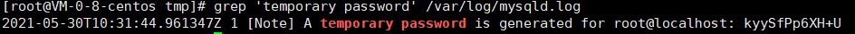


首次通过初始密码登录后，使用以下命令修改密码

```bash
mysql -uroot -p
mysql> ALTER USER 'root'@'localhost' IDENTIFIED BY ']~P(Xmt;[LO3';  #重置 root 密码，不然会影响后面创建用户，如下图
```


或者

```bash
mysql> set password for 'root'@'localhost'=password('MyNewPass4!'); 
```

以后通过 update set 语句修改密码

```bash
mysql> use mysql;
mysql> update user set password=PASSWORD('MyNewPass5!') where user='root';
mysql> flush privileges;
```

> 注意：mysql 5.7 默认安装了密码安全检查插件（validate_password），默认密码检查策略要求密码必须包含：大小写字母、数字和特殊符号，并且长度不能少于8位。否则会提示 ERROR 1819 (HY000): Your password does not satisfy the current policy requirements 错误。查看 [MySQL官网密码详细策略](https://links.jianshu.com/go?to=https%3A%2F%2Fdev.mysql.com%2Fdoc%2Frefman%2F5.7%2Fen%2Fvalidate-password-options-variables.html%23sysvar_validate_password_policy)

8. 添加远程登录用户

默认只允许root帐户在本地登录，如果要在其它机器上连接mysql，必须**添加一个允许远程连接的帐户**。或者~~修改 root 为允许远程连接~~（不推荐）

添加一个允许远程连接的帐户

```bash
GRANT ALL PRIVILEGES ON *.* TO 'xincan'@'%' IDENTIFIED BY 'Xincan2021!' WITH GRANT OPTION;
ALTER USER 'xincan'@'%' IDENTIFIED BY ']~P(Xmt;[LO3';
```

~~修改 root 为允许远程连接~~（不推荐）

```php
mysql> use mysql;
mysql> UPDATE user SET Host='%' WHERE User='root';
mysql> flush privileges;
```

9. 设置默认编码为 utf-8

mysql 安装后默认不支持中文，需要修改编码。
 修改 `/etc/my.cnf` 配置文件，在相关节点（没有则自行添加）下添加编码配置，如下：

```csharp
[mysqld]
character-set-server=utf8
[client]
default-character-set=utf8
[mysql]
default-character-set=utf8
```

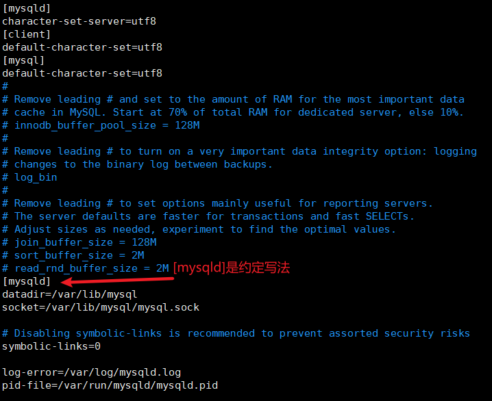

重启mysql服务，查询编码。可以看到已经改过来了

```bash
shell> systemctl restart mysqld
shell> mysql -uroot -p # mysql -uxincan -p，回车后输入密码
mysql> show variables like 'character%';
```

修改前：

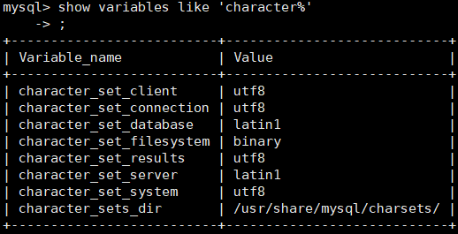

修改后：

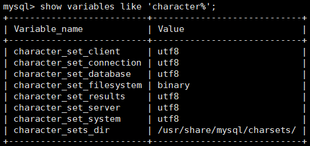


10. 默认配置文件

配置文件：/etc/my.cnf （mysql核心配置文件）

日志文件：/var/log/mysqld.log

服务启动脚本：/usr/lib/systemd/system/mysqld.service

socket文件：/var/run/mysqld/mysqld.pid

应用目录：/var/lib/mysql

数据文件：/var/lib/mysql/mysql


11. 客户端连接

TODO 不能用 root 身份登录


### Redis安装（tar.gz）

1. 下载安装包 https://redis.io/

```bash
# cd /tmp
wget https://download.redis.io/releases/redis-6.2.3.tar.gz
```

2. 解压安装包，放入 /opt 目录，作为我们的程序目录

```bash
tar -zxvf redis-6.2.3.tar.gz
cd /redis-6.2.3
cp redis.conf redis.conf.bak # 复制一份配置
```

3. 安装 redis

```bash
#进入redis目录
#安装 c++ 环境，redis 是C++写的
yum install gcc-c++
gcc -v

make #编译
make install #安装
```


4. redis 的默认安装路径

==延申==：用户自行安装的程序默认在 `/usr/local/bin` 中


6. 把 redis.config 拷贝移动到 /user/local/bin/conf 下单独维护（最佳实践）

```bash
mkdir /usr/local/bin/conf
cp redis.conf /usr/local/bin/conf/
```

7. redis 默认不是后台启动的，修改配置文件如下


8. 启动redis服务

```bash
redis-server /usr/local/bin/conf/redis.conf
```

9. 客户端连接

```bash
redis-cli -p 6379
```

==注意==如果 redis-cli 无反应，可以 reboot 重启后再试


10. 查看redis进程服务

```bash
 ps -ef |grep redis
```

看到服务端和客户端的进程都有


## Ubuntu

更新命令

sudo apt-get update     是更新软件列表

sudo apt-get upgrade   是更新软件

安装命令

sudo apt-get install


